# Lua Lander 2D
A 2D Finite Physics-based landing game built in Unity, where: - 

1. Realistic Physics-Based Mechanics for the Player’s Rocket. 

2. Skill-Focused Gameplay to make a good user experience. 

3. Progressive Difficulty increases as the level rises. 

4. 1x and 5x score multiplier Landing Pads. 

## MainMenuScene

## StartScene
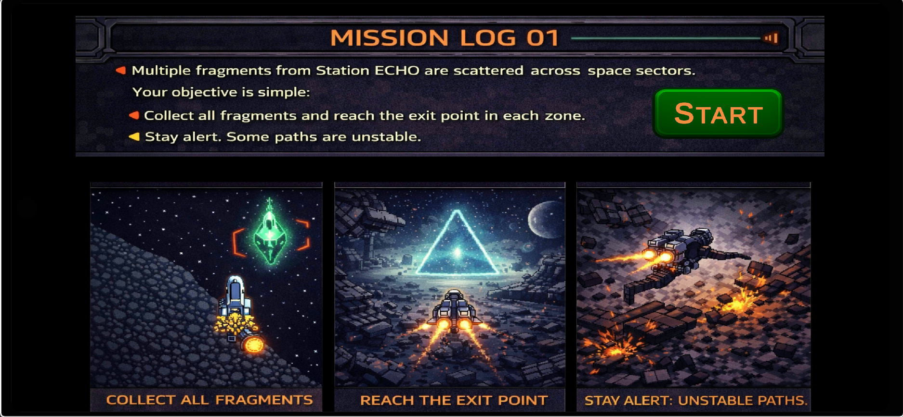

## LevelScene
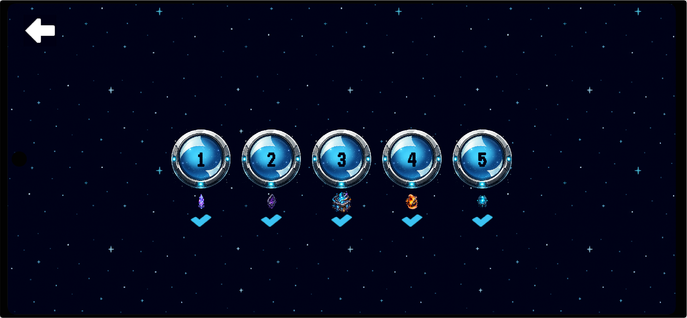

## Level-1
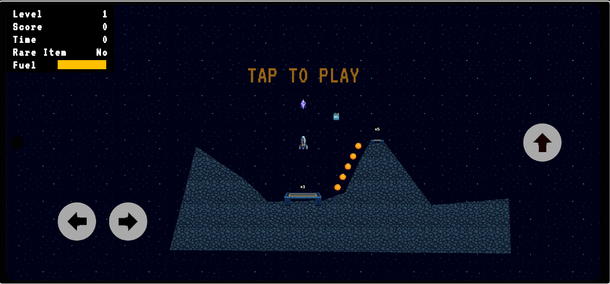

## Level-2
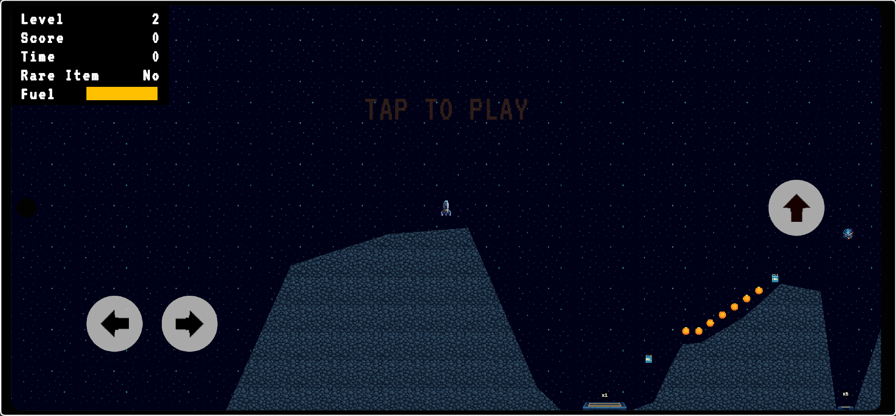

## Level-3
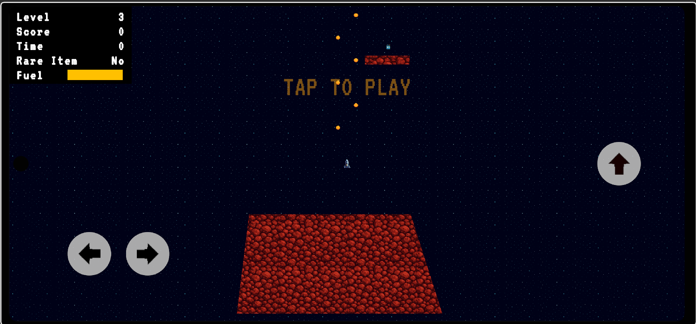

## Level-4
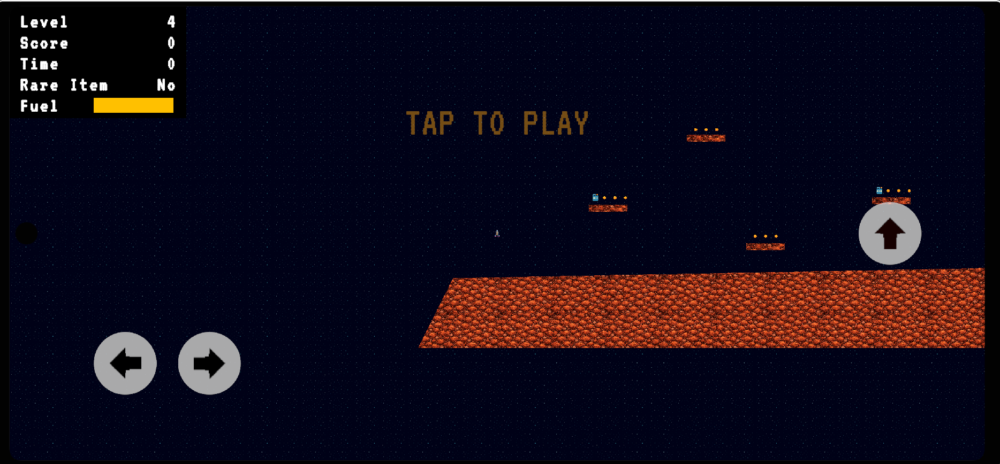

## Level-5
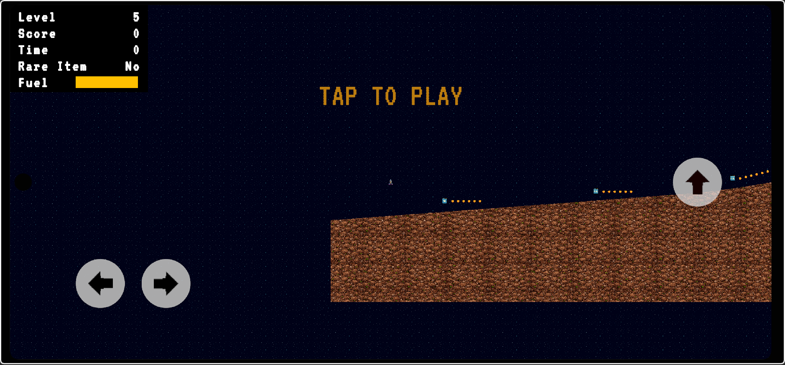

## EndScene
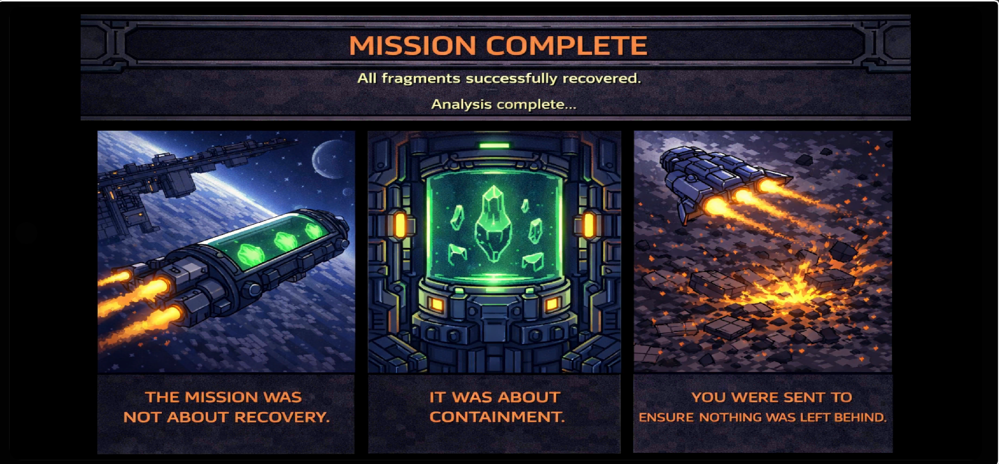

## Paused
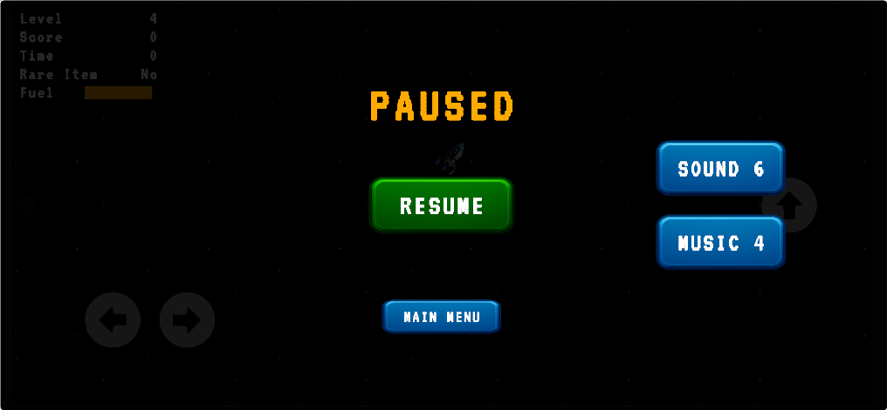

## Crashed
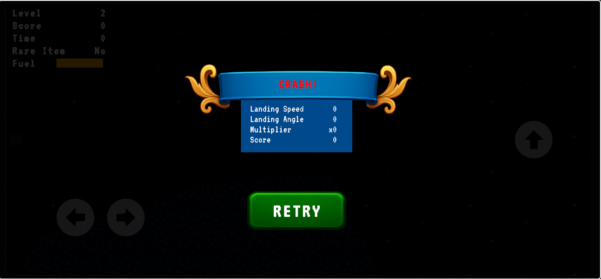

## Successful Landing
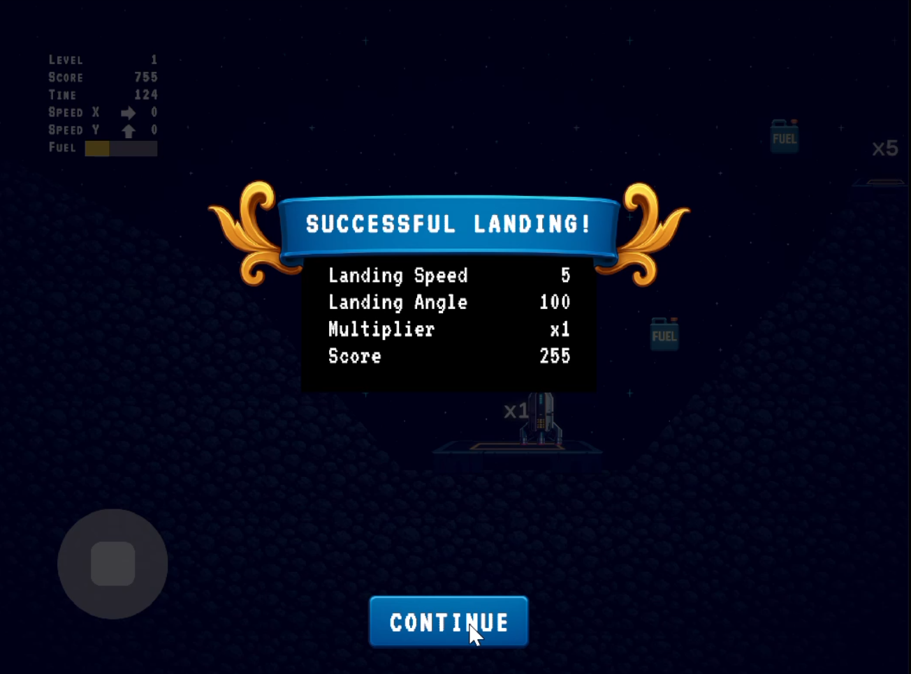

## Game Over
